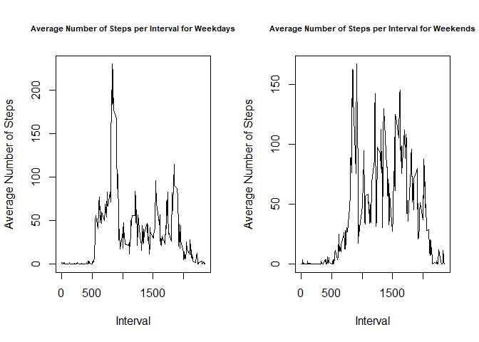

## Loading and preprocessing the data


```r
df = read.csv(unz("activity.zip", "activity.csv"))
df$date = as.Date(as.character(df$date))
```

## What is mean total number of steps taken per day?


```r
library(dplyr)
library(ggplot2)

df1= df %>% 
    group_by(date) %>% 
    summarise(steps = sum(steps,na.rm=TRUE))

ggplot(df1,aes(steps)) + geom_histogram() + 
    labs(title="Histogram for Total Number of Steps per Day") + 
    labs(x="Total Number of Steps per Day", y="Frequency") + 
    theme(plot.title = element_text(hjust = 0.5))
```

<!-- -->

```r
mean_daily_steps = mean(df1$steps, na.rm=TRUE)
median_daily_steps = median(df1$steps, na.rm=TRUE)
```

The mean of the total number of steps taken per day is 9354.2295082.

The median of the total number of steps taken per day is 10395.

## What is the average daily activity pattern?


```r
df2 = df %>% 
    group_by(interval) %>% 
    summarise(steps = mean(steps,na.rm=TRUE))

plot(df2$interval, df2$steps, type="l"
     , main = "Average Number of Steps per 5-Minute Interval"
     , xlab = "Interval"
     , ylab = "Average Number of Steps")
```

<!-- -->

```r
interval_max_steps = df2$interval[which.max(df2$steps)]
max_steps = max(df2$steps)
```

Step 835 contains the maximum number of steps (206.1698113) on average across all the days in the dataset.

## Imputing missing values


```r
library(dplyr)
library(ggplot2)

cnt_rows_missing_values = sum(!complete.cases(df))

impute.mean = function(x) replace(x, is.na(x), mean(x, na.rm = TRUE))
df3 = df %>%
    group_by(interval) %>%
    mutate(steps = impute.mean(steps))

df3_daily = df3 %>% 
    group_by(date) %>% 
    summarise(steps = sum(steps,na.rm=TRUE))

ggplot(df3_daily,aes(steps)) + geom_histogram() + 
    labs(title="Histogram for Total Number of Steps per Day (Missing Values Imputed)") + 
    labs(x="Total Number of Steps per Day", y="Frequency") + 
    theme(plot.title = element_text(hjust = 0.5))
```

<!-- -->

```r
mean_daily_steps_impute = mean(df3_daily$steps, na.rm=TRUE)
median_daily_steps_impute = median(df3_daily$steps, na.rm=TRUE)

diff_mean = mean_daily_steps_impute - mean_daily_steps
diff_median = median_daily_steps_impute - median_daily_steps
```

After imputing missing values with the average steps for individual 5-minute interval, the mean of the total steps per day changed to 1.0766189\times 10^{4} and the median changed to 1.0766189\times 10^{4}. 

The difference between the two means is 1411.959171. The difference between the two medians is 371.1886792.

## Are there differences in activity patterns between weekdays and weekends?


```r
library(dplyr)
library(ggplot2)

cnt_rows_missing_values = sum(!complete.cases(df))

impute.mean = function(x) replace(x, is.na(x), mean(x, na.rm = TRUE))
df4 = df %>%
    group_by(interval) %>%
    mutate(steps = impute.mean(steps))

workdays = c('Monday', 'Tuesday', 'Wednesday', 'Thursday', 'Friday')
df4$wDay <- factor((weekdays(df4$date) %in% workdays), 
                   levels=c(FALSE, TRUE), labels=c('weekend', 'weekday')) 

df4_interval_weekday = df4[df4$wDay=="weekday",] %>% 
    group_by(interval) %>% 
    summarise(steps = mean(steps,na.rm=TRUE))

df4_interval_weekend = df4[df4$wDay=="weekend",] %>% 
    group_by(interval) %>% 
    summarise(steps = mean(steps,na.rm=TRUE))

par(mfrow=c(1,2))

plot(df4_interval_weekday$interval, df4_interval_weekday$steps
     , type = "l"
     , main = "Average Number of Steps per Interval for Weekdays"
     , xlab = "Interval"
     , ylab = "Average Number of Steps"
     , cex.main =0.7)

plot(df4_interval_weekend$interval, df4_interval_weekend$steps
     , type = "l"
     , main = "Average Number of Steps per Interval for Weekends"
     , xlab = "Interval"
     , ylab = "Average Number of Steps"
     , cex.main =0.7)
```

<!-- -->
